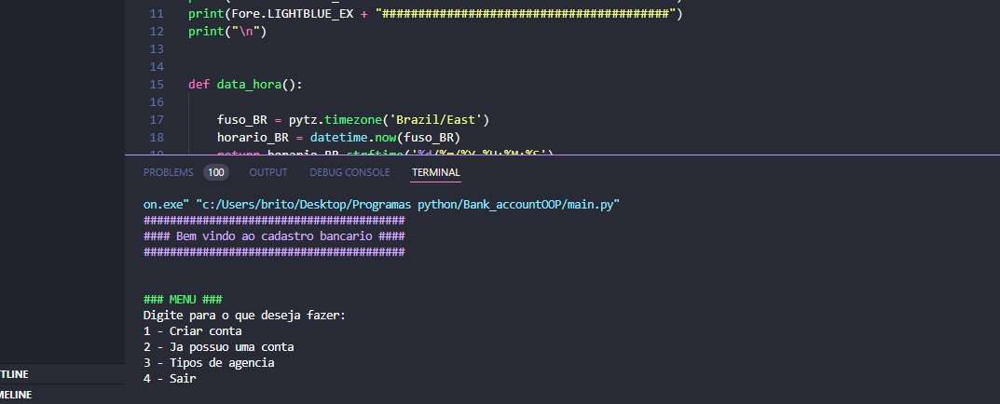
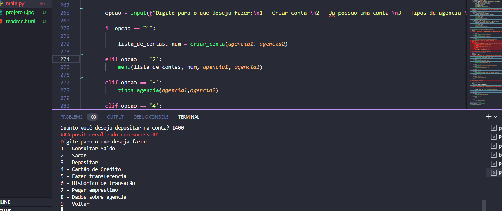
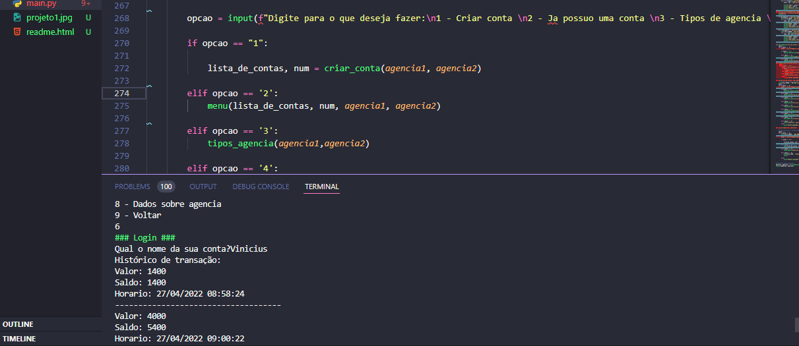

<h3>A project using python concepts</h3>

In this project, the main concepts of <b>python</b> were used

<ul>
    <li>Object Oriented Programming (OOP)</li>
    <li>Subclass</li>
    <li>Inheritance</li>
    <li>Polymorphism</li>
    <li>Pthon concepts</li> 
</ul>

<h3>#1</h3>

<h3>#2</h3>

<h3>#3</h3>

